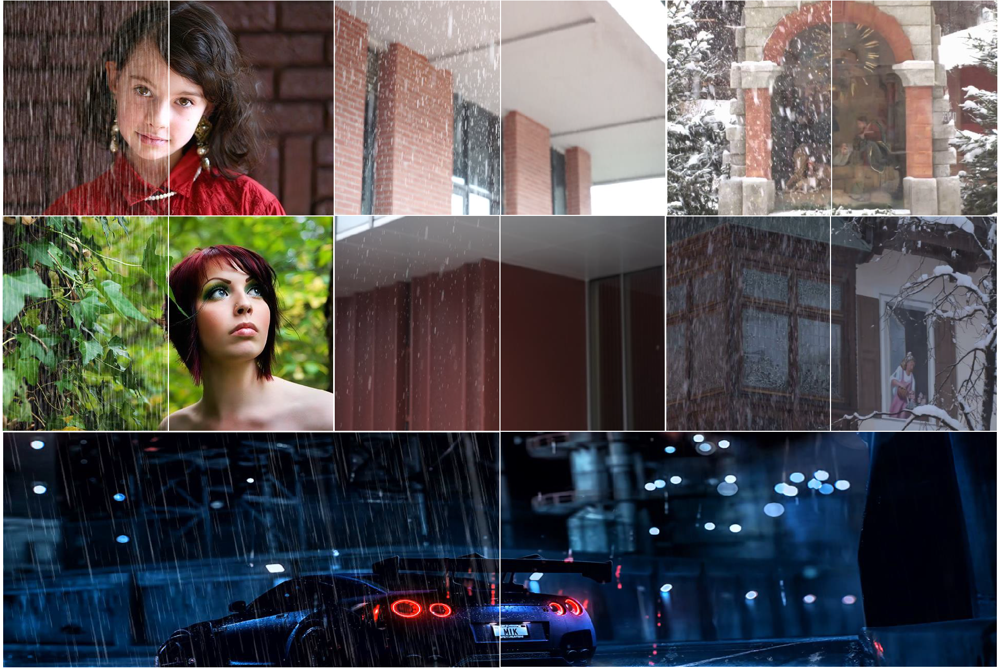
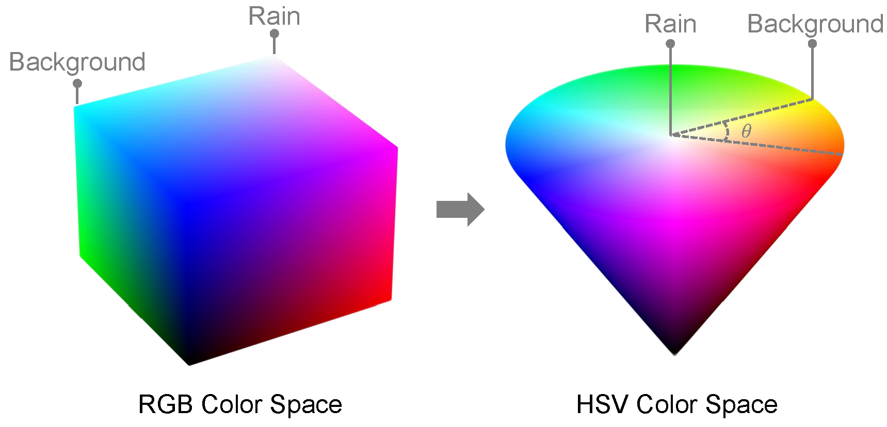
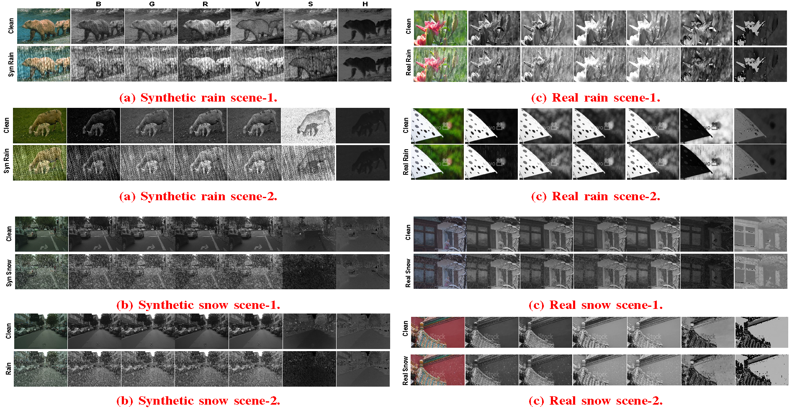
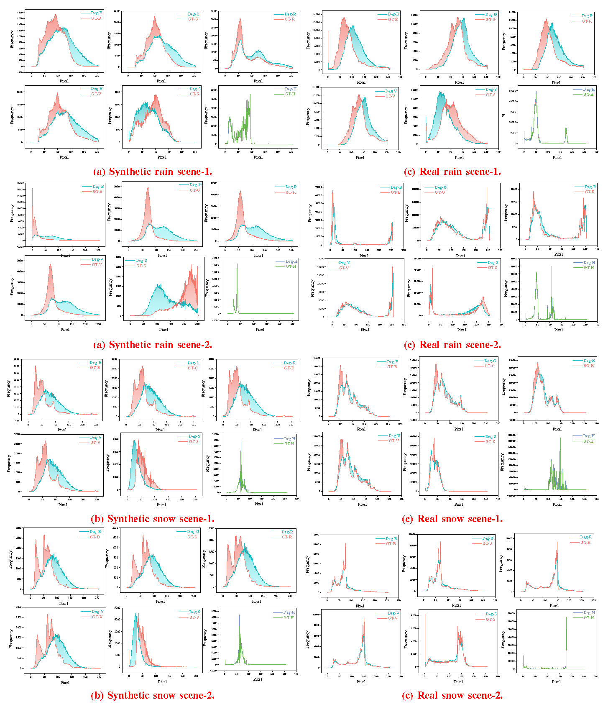
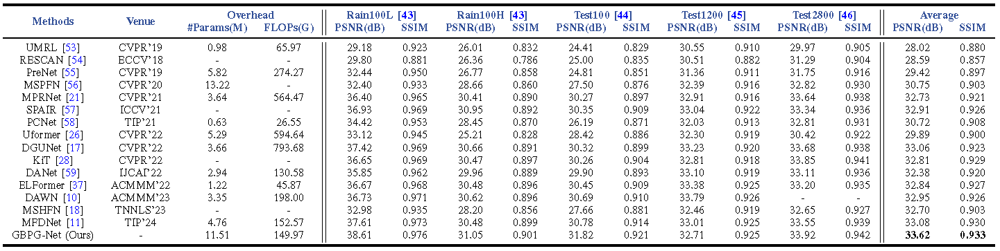
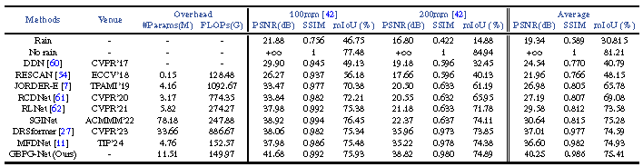
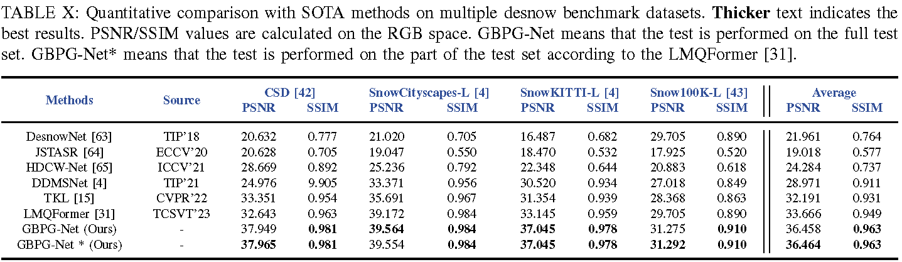
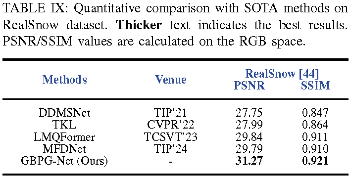
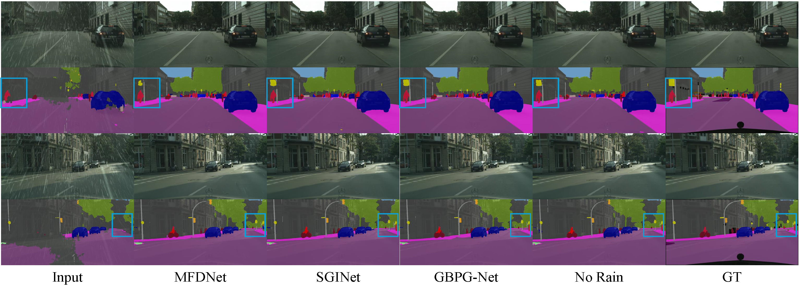

# **GBPG-Net: Global Background Prior Guided Rain and Snow Image Restoration**

## :writing_hand: Changelog and ToDos
- [ ] Code and the model pre-training weights.
- [x] Method introduction, model performance and results visualization  :fire::fire::fire:.

## :bulb: Abstract
> The aim of image restoration in the presence of rain and snow effects is to eliminate these disturbances while retaining the underlying background structure. Most existing methods tend to directly learn the mapping from corrupted images to clean ones, often resulting in residual rain or snow artifacts and compromised background structures. In this work, both theoretical analysis and experimental findings confirm the robustness of the hue channel in HSV color space to rain and snow disturbances, even when extracted from corrupted images. Motivated by this insight, we propose to leverage the global clean background cues inherent in the hue channel to guide the network in preserving the image background structure and removing interference. To this end, we introduce the Global Background Prior Guided Network (GBPG-Net) for restoring rain and snow-affected images, which employs a triangular formation to facilitate continuous interaction and updating of the Global Background Prior (GBP) with the image feature within the GBPG-unit, resulting in improved interference removal and background structure preservation. Specifically, the GBPG-Net incorporates the Global Clean Background Prior Injector (GCBPI) to inject the GBP into the network. Subsequently, the Prior-Guided Local Detail Excavation (PGLDE) module, build on GCBPI, further refines interference removal and structure preservation to process local details intricately. Finally, the Prior-Guided Local-Global Aggregation (PGLGA) module aggregates global background features with local detailed features, enabling the network to better understand the overall content and subtle interference for more accurate reconstruction. Quantitative and qualitative evaluations on synthetic and real datasets demonstrate the effectiveness of the proposed \arch in de-raining and de-snowing tasks, highlighting its advantages over existing methods.

## 😃 Motivation
> ### **Theoretical analysis**
>
> The RGB model represents colors using the combination of the red (R), green (G) and blue (B) channels. The HSV model describes colors using three parameters: Hue (H), Saturation (S), and Luminance (V), which delineating the type or position of the color, the degree of vibrancy, and the degree of lightness or darkness, respectively. The hue channel is often visualized as a color wheel, where different hues are represented by angles ranging from 0 to 360 degrees. The color of snow and rain is white, which means they reflect all wavelengths of visible light equally. In terms of hue, white doesn't have a specific hue angle. Insteadly, it can be conceptualized as situated at the center of the color wheel, implying no particular hue preference. Therefore, snow or rain behaves consistently with the background, making it difficult to distinguish them from the background when looking at scenes containing these interferences in the hue channel. 
>
> 

> ### **Experimental analysis**
>
> (1) We visualize the channels of rain- and snow-affected images alongside clean images under different color models, as shown in Figure 1. The results indicate that rain and snow perturbations are nearly invisible in the hue channel of the HSV space compared to other color channels. For instance, in real rain and snow images, the hue channel exhibits significantly less degradation interference, whereas other channels are dominated by such interference. This demonstrates that the other channels are not robust to degradation and cannot serve as clean background cues for guiding the network in interference removal.
>
> (2) Additionally, pixel histogram distributions of rain- and snow-affected images and clean images are visualized in Figure 2, further confirming that these images share a similar statistical distribution in the hue channel of the HSV color model. This suggests that the hue channel retains clean background structural information even when extracted from rain- or snow-affected images. Consequently, rain and snow behave consistently with the background in the hue channel, making them difficult to distinguish from the background in scenes containing these perturbations.
>
> (3) Thus, both theoretical analysis and experimental findings demonstrate that the hue channel is robust to degradation, even when extracted from rain- and snow-affected images. The global clean background cues it preserves can effectively guide the network in learning to remove rain perturbations.
>
> 
> 

## :sparkles: De-raining Task
- **Synthetic Image Experiment**
> ### **Quantitative Comparison with SOTA**
> 
> 

> ### **Qualitative Comparison with SOTA**
> 

- **Real Image Experiment**

> ### **Quantitative Comparison with SOTA**

> 

> ### **Qualitative Comparison with SOTA**
> 

## :sparkles: De-snowing Task
- **Synthetic Image Experiment**
> ### **Quantitative Comparison with SOTA**

> ### **Qualitative Comparison with SOTA**
> 

- **Real Image Experiment**

> ### **Quantitative Comparison with SOTA**

> 

> ### **Qualitative Comparison with SOTA**
> 

## :sparkles: Downstream Task

